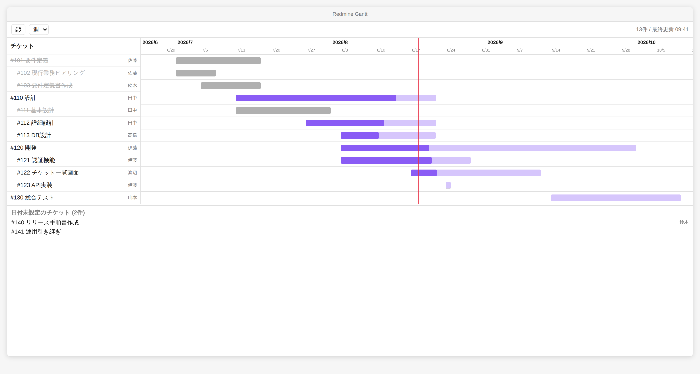
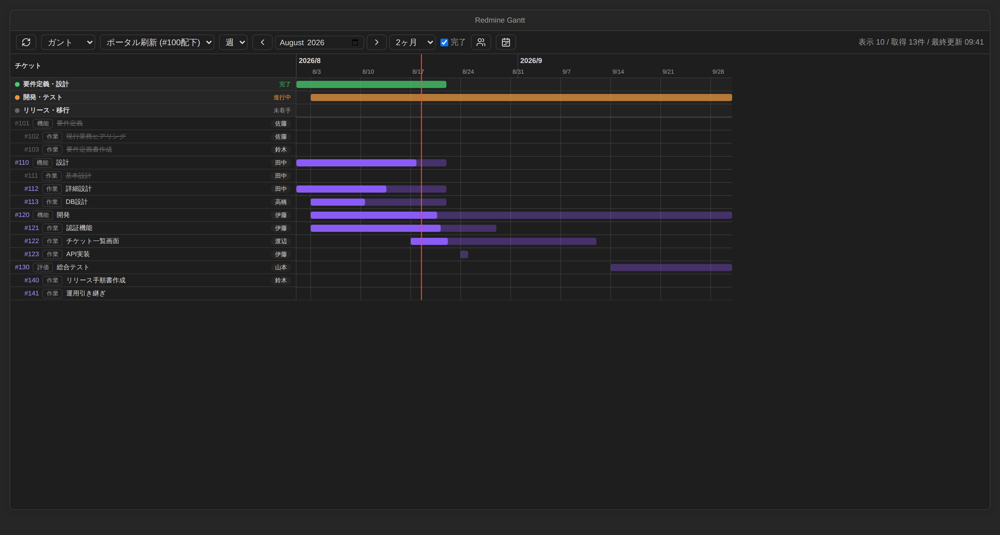
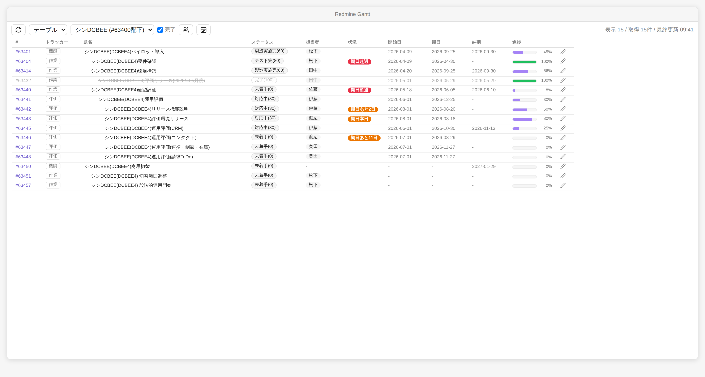

# Redmine Gantt for Obsidian

オンプレの Redmine からチケットを取得し、Obsidian 上にガントチャート/テーブルで表示するプラグインです。テーブルの編集ボタンから、チケットの主要フィールド(ステータス・担当者・開始日・期日・納期・進捗率)を Redmine へ更新できます。

構成の詳細は [docs/ARCHITECTURE.md](docs/ARCHITECTURE.md) を参照してください。

## 画面イメージ

サンプルデータでの表示例(週スケール)。テーマのライト/ダークに自動で追従します。





テーブル表示(トラッカー・納期列、進捗バー、列幅ドラッグ調整対応):



## 機能(Phase 1 / MVP)

- Redmine REST API からチケットを全件取得(ページング対応、完了チケットの表示切替可)
- **表示フィルタの切り替え**: 設定で複数のフィルタを登録し、ツールバーのドロップダウンで切り替え
  - 親チケット配下(指定チケットとその配下ツリー全体を再帰取得)
  - Redmineの保存クエリ(`query_id`)
  - 負荷対策のため、プロジェクト全体の一括取得は行いません(フィルタの設定が必須)
- **表示モードの切り替え**: ガントチャート / チケット一覧テーブルをツールバーで切り替え(選択は記憶)
  - テーブルは # / トラッカー / 題名 / ステータス / 担当者 / **状況** / 開始日 / 期日 / **納期** / 進捗 / 編集 の列構成。列幅はヘッダー境界のドラッグで調整可能
  - 納期列は Redmine のカスタムフィールド「納期」の値を表示
  - **状況列**: 現在日と期日(なければ納期)を比較し、**2週間以内**ならオレンジのバッジで「期日あとXX日」(当日は「期日本日」)、超過は赤バッジで「期日超過」を表示。2週間より先・完了チケットは何も表示しない
  - コンパクトな行高で一覧性を重視
- **完了チケットの表示切替**: ツールバーの「完了」チェックで切替(既定: 非表示)。再取得なしで即時反映
- **担当者絞り込みモード**: ツールバーの人物アイコンから担当者を複数選択すると、その担当者のチケットだけを表示し、担当者ごとに色分け(ガントのバー・テーブルのチップ)
- **担当者の固定色**: 設定で「担当者名+色」を登録すると、表示フィルタや絞り込みの選択にかかわらず、その担当者は常にその色で表示される(絞り込みモードの自動配色より優先)
- **チケットの編集**: テーブル各行の鉛筆ボタンから編集モーダルを開き、ステータス / 担当者 / 開始日 / 期日 / 納期 / 進捗率を変更して Redmine へ反映(`PUT /issues/:id.json`)
  - モーダルを開くたびに最新のチケットを取得し、**変更したフィールドだけ**を送信
  - ステータスは全一覧から選択(ワークフロー上不可能な遷移は Redmine がエラーを返し、その内容を表示)
  - 担当者候補はプロジェクトのメンバー一覧から取得(取得できない場合は現担当者のみ)
  - 保存後は該当チケットだけ再取得して表示を更新
- **全体予定**: Redmineとは独立した予定をプラグイン内で管理し、ガントの最上段に表示
  - ツールバーのカレンダーアイコンから追加・編集・削除(予定名・期間・状態)
  - 状態(未着手/進行中/完了)ごとに色分け表示。データは Vault 内の `data.json` に保存
- 専用ビューでのガントチャート表示
  - **表示期間の指定**: 開始月と表示月数(1/2/3/6/12ヶ月)をツールバーで指定。既定は当月から2ヶ月。前月/次月ボタンで移動でき、範囲外のバーは端で切り詰めて表示
  - 日 / 週 / 月のスケール切替
  - 進捗率(`done_ratio`)による塗り分け、今日の縦線、日スケールでの週末表示
  - 親チケット配下に子チケットをインデント表示
  - チケット名・バークリックでブラウザの Redmine チケットを開く
- **ツリー表示の維持**
  - 日付の有無に関係なく全チケットを親子ツリーの位置に表示(日付なしはバーなしの行)
  - 完了フィルタ・担当者絞り込み・保存クエリの条件で親が対象外になった場合も、親をグレーの「コンテキスト行」として補い、Redmineと同じツリー構造を維持(補った親は表示件数に含めない)
- 日付のフォールバック
  - 開始日なし・期日あり → 作成日を開始日として推定(破線表示)
  - 開始日あり・期日なし → 1日分のバー(破線表示)

## 事前準備(Redmine 側)

1. 「管理 → 設定 → API」で **REST APIを有効にする** をオンにする
2. 「個人設定」ページで **APIアクセスキー** を確認する

## インストール(ビルド不要)

ビルド済みの `main.js` をリポジトリに含めているため、Node.js は不要です。

1. このリポジトリをダウンロード(またはクローン)する
2. Vault の `.obsidian/plugins/redmine-gantt/` フォルダを作成し、`main.js` / `manifest.json` / `styles.css` の3ファイルをコピーする
3. Obsidian の設定 → コミュニティプラグインで「Redmine Gantt」を有効化

ソースを変更した場合は `npm install && npm run build` で `main.js` を再生成してください(コミットに含めます)。

## 設定

| 項目 | 説明 |
|---|---|
| Redmine URL | 例: `https://redmine.example.local` |
| APIキー | 個人設定ページの API アクセスキー |
| 既定のスケール | 日 / 週 / 月 |
| 表示フィルタ | 表示するチケットの取得条件。**いずれか1つ以上の登録が必須**(下記) |
| 担当者の色分け | 常に色分けしたい担当者を「表示名+色」で登録(カラーピッカー付き)。名前はRedmineの表示名と完全一致 |

### 表示フィルタ

負荷を抑えるため、プロジェクト全体を一括取得するフィルタは提供していません。表示対象は必ず以下のいずれかで絞り込みます。

| 種類 | 値の指定 | 動作 |
|---|---|---|
| 親チケット配下 | チケット番号(例: `1234`) | 指定チケットと、その配下ツリー全体を**再帰的に**取得。`parent_id=~ID`(全子孫)で一括取得し、未対応のRedmineでは1親ずつ階層を辿る |
| 保存クエリ | クエリ ID(チケット一覧 URL の `query_id=` の数値) | Redmine 側で保存したカスタムクエリの条件をそのまま適用。ステータス等の絞り込みもクエリ側の定義に従う。プロジェクト内で保存したクエリは所属プロジェクトを自動解決する(`プロジェクト識別子:クエリID` の明示指定も可) |

> 保存クエリは、APIキーのユーザーがアクセスできるもの(自分のクエリ、または公開クエリ)のみ使えます。

> **注意**: API キーは Vault 内の `.obsidian/plugins/redmine-gantt/data.json` に平文で保存されます。Vault を同期サービスに載せている場合はキーも同期されます。

## 使い方

リボンのガントチャートアイコン、またはコマンドパレットの「Redmine Gantt: ガントチャートを開く」でビューを開きます。

ツールバー(左から): 再取得 / 表示モード(ガント・テーブル) / 表示フィルタ / スケール(日・週・月) / 表示期間(前月・開始月・次月・表示月数) / 完了チケットの表示切替 / 担当者絞り込み / 全体予定の編集。表示モードとフィルタの選択は記憶され、次回も同じ表示で開きます。

- **表示期間**: 開始月と表示月数(既定: 当月から2ヶ月)。‹ › ボタンで1ヶ月ずつ移動します
- **完了チェック**: オンで終了ステータスのチケットも表示(既定はオフ)。取得済みデータの絞り込みなので切替は即時です
- **担当者絞り込み**: 人物アイコンで一覧を開き、チェックした担当者のチケットだけを色分け表示。「(担当者なし)」も選べます。選択なしなら全員表示
- **テーブルの列幅**: 列ヘッダーの右端をドラッグして調整できます
- **チケットの編集**: テーブル行末の鉛筆ボタンで編集モーダルを開きます。編集にはAPIキーのユーザーにチケット編集権限が必要です

### 全体予定

Redmineのチケットとは別に、フェーズやマイルストーンなどの大枠の予定をプラグイン内で管理できます。ツールバーのカレンダーアイコンで編集画面を開き、予定名・開始日・終了日・状態(未着手/進行中/完了)を設定します。ガントチャートの最上段に状態ごとの色(グレー/オレンジ/緑)で表示されます。Redmineには一切書き込まれません。

## 開発

```bash
npm install
npm run dev    # watch ビルド
npm run build  # 型チェック + 本番ビルド
```
